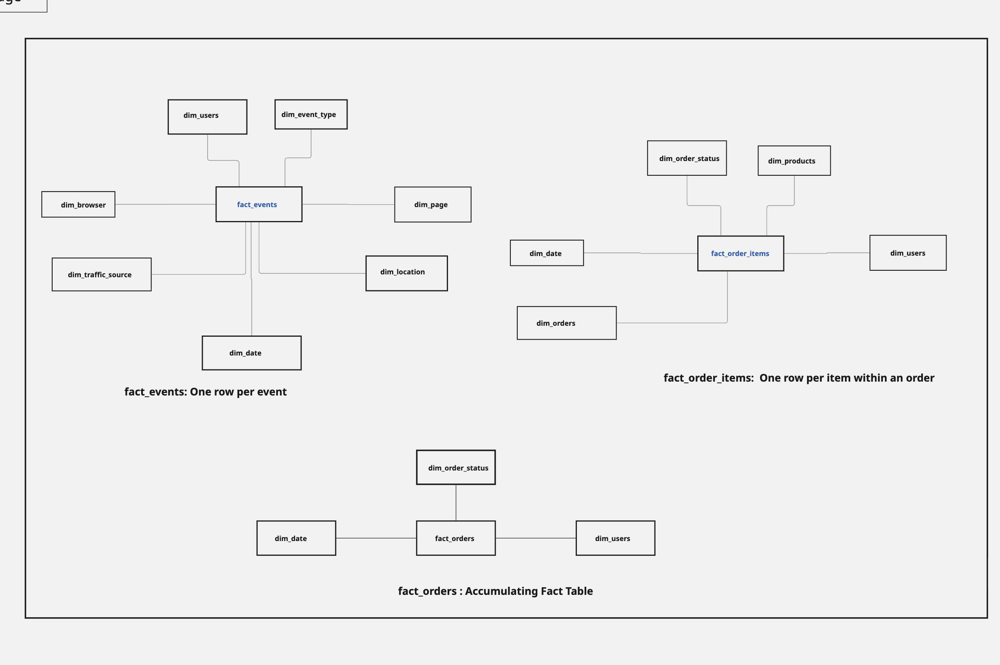
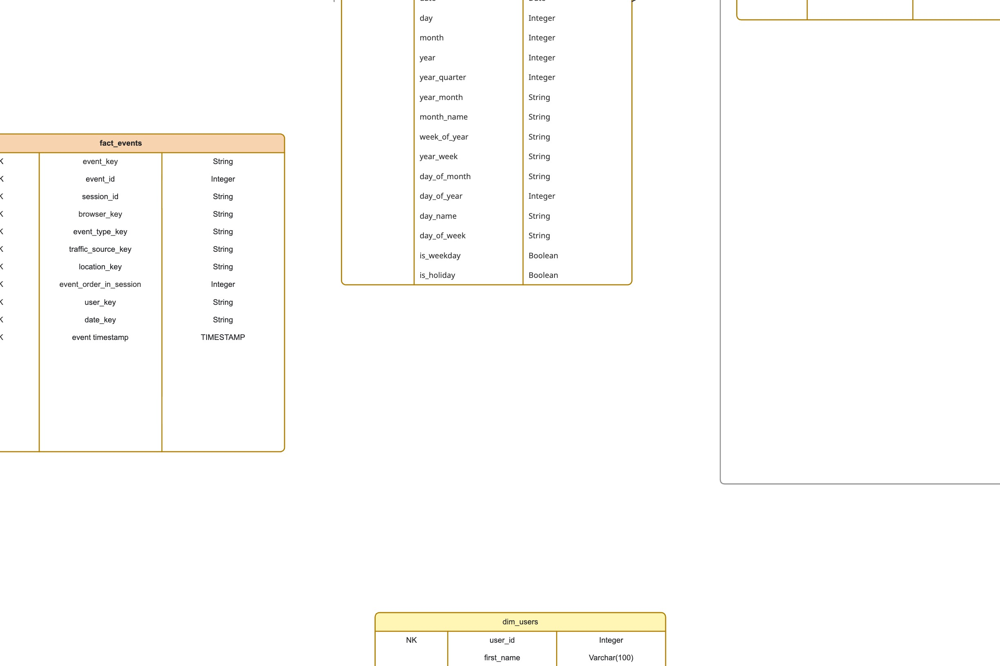

# E-commerce Data Pipeline

Designed and implemented a modern **ETL data pipeline** using the **medallion architecture** (bronze → silver → gold layers) to process the **Looker E-commerce BigQuery Dataset** (sourced as CSV files from Kaggle) using bottom-up approach (Dimensional Data Modelling). The pipeline transforms raw e-commerce  data into clean, analytics-ready layers to enable deep insights.


## ⚙️ Tech Stack

- **Google BigQuery** – Data warehouse  
- **Apache Airflow** – Orchestration & scheduling  
- **SQL (BigQuery Standard SQL)** – Data transformations  
- **Metabase** – Analytics & dashboards  
- **GitHub** – Version control & documentation  
- **Architecture Pattern**: Medallion architecture (bronze → silver → gold)
 

## Business Questions Addressed

The pipeline is built to answer the following key business questions:

1. **How do customers behave on the website?**  
   - Navigation patterns and common session flows  
   - Most frequent events (views, clicks, add-to-cart, etc.)  
   - Influence of traffic sources on user actions and conversions

2. **What factors drive customers to make a purchase?**  
   - Behavioral signals that precede purchases  
   - Traffic sources with the highest conversion rates  
   - Event sequences correlated with buying behavior

3. **How are different products performing?**  
   - Top-selling products and underlying reasons  
   - Differences in buyer characteristics by product  
   - Impact of product attributes (price, category, etc.) on sales

## Source Data Schema

The pipeline processes the **Looker E-commerce BigQuery Dataset** (originally from Kaggle), which consists of the following seven CSV files. Below is the schema for each table, including column names, data types, and brief descriptions where relevant.

### 1. distribution_centers.csv
Distribution centers / warehouses

- `id` (INT) — Distribution center ID (primary key)
- `name` (STRING) — Name of the distribution center
- `latitude` (FLOAT) — Latitude coordinate
- `longitude` (FLOAT) — Longitude coordinate

### 2. events.csv
User website interactions (page views, add-to-cart, purchases, etc.)

- `id` (INT) — Event ID (primary key)
- `user_id` (INT) — References `users.id`
- `sequence_number` (INT) — Order of events within a session
- `session_id` (STRING) — Unique session identifier
- `created_at` (TIMESTAMP) — When the event occurred
- `ip_address` (STRING) — Visitor IP address
- `city` (STRING) — City of the visitor
- `state` (STRING) — State / region
- `postal_code` (STRING) — Postal / ZIP code
- `browser` (STRING) — Browser used
- `traffic_source` (STRING) — Source of traffic (Organic, Paid, Email, Direct, etc.)
- `uri` (STRING) — Page or resource accessed
- `event_type` (STRING) — Type of event (e.g., 'Page View', 'Add to Cart', 'Purchase')

### 3. inventory_items.csv
Physical inventory records (snapshot of items in stock)

- `id` (INT) — Inventory item ID (primary key)
- `product_id` (INT) — References `products.id`
- `created_at` (TIMESTAMP) — When inventory record was created
- `sold_at` (TIMESTAMP) — When the item was sold (NULL if still in stock)
- `cost` (DECIMAL) — Cost to the company
- `product_category` (STRING) — Product category
- `product_name` (STRING) — Product name
- `product_brand` (STRING) — Brand name
- `product_retail_price` (DECIMAL) — Retail price
- `product_department` (STRING) — Department (e.g., Women, Men)
- `product_sku` (STRING) — Stock Keeping Unit
- `product_distribution_center_id` (INT) — References `distribution_centers.id`

### 4. order_items.csv
Line items within orders (the most granular sales data)

- `id` (INT) — Order item ID (primary key)
- `order_id` (INT) — References `orders.order_id`
- `user_id` (INT) — References `users.id`
- `product_id` (INT) — References `products.id`
- `inventory_item_id` (INT) — References `inventory_items.id`
- `status` (STRING) — Order item status (Processing, Shipped, Delivered, Returned, Cancelled, Complete)
- `created_at` (TIMESTAMP) — When the order item was created
- `shipped_at` (TIMESTAMP) — When shipped
- `delivered_at` (TIMESTAMP) — When delivered
- `returned_at` (TIMESTAMP) — When returned (NULL if not returned)

### 5. orders.csv
Order headers

- `order_id` (INT) — Order ID (primary key)
- `user_id` (INT) — References `users.id`
- `status` (STRING) — Overall order status
- `gender` (STRING) — Gender of the purchaser (Women, Men)
- `created_at` (TIMESTAMP) — Order creation timestamp
- `returned_at` (TIMESTAMP) — When the order was returned (NULL if not returned)
- `shipped_at` (TIMESTAMP) — When the order was shipped
- `delivered_at` (TIMESTAMP) — When the order was delivered
- `num_of_item` (INT) — Number of items in the order

### 6. products.csv
Product catalog

- `id` (INT) — Product ID (primary key)
- `cost` (DECIMAL) — Cost to the company
- `category` (STRING) — Product category
- `name` (STRING) — Product name
- `brand` (STRING) — Brand name
- `retail_price` (DECIMAL) — Selling price
- `department` (STRING) — Department (Women, Men)
- `sku` (STRING) — Stock Keeping Unit
- `distribution_center_id` (INT) — References `distribution_centers.id`

### 7. users.csv
Registered customers

- `id` (INT) — User ID (primary key)
- `first_name` (STRING)
- `last_name` (STRING)
- `email` (STRING)
- `age` (INT)
- `gender` (STRING) — Gender
- `state` (STRING) — State / region
- `street_address` (STRING) — Street address
- `postal_code` (STRING) — Postal / ZIP code
- `city` (STRING) — City
- `country` (STRING) — Country
- `latitude` (FLOAT) — Latitude
- `longitude` (FLOAT) — Longitude
- `traffic_source` (STRING) — How the user originally arrived (Organic, Adwords, Email, etc.)
- `created_at` (TIMESTAMP) — Account creation timestamp

**Note**:  
Not all tables/columns are used in the core analytical model. The pipeline focuses on data relevant to customer behavior, purchase drivers, and product performance (see [Data Scope & Profiling](#data-scope--profiling) and [Dimensional Modeling](#dimensional-modeling---kimball-type-2)).

## Data Scope & Profiling

**Focused Scope**  
Only data relevant to the business questions above was included. Non-essential tables were excluded during profiling to reduce complexity and ensure alignment with core analytics needs.

**Tables Excluded**  
- `distribution_centers` — logistics-focused, not directly tied to customer behavior or purchases  
- `inventory_items` — physical stock tracking; product details are sufficiently covered by `products` and `order_items`

**Included Sources** (based on TheLook e-commerce schema)  
- Events (user interactions: views, clicks, add-to-cart, etc.)  
- Order Items (purchases, status, revenue)  
- Users (customer attributes)  
- Products (item details, categories, price)  

## Architecture Overview


The pipeline follows the **medallion pattern**:

## 🧱 Data Layers Explained

### Extract System
   Data landed in GCS with partitioned structure:  
   gs://your-bucket/raw-data/ingestion_date=events/date=2026-02-07/file.csv

### 🥉 Bronze Layer
- Raw ingestion from source systems  
- Minimal transformations  
- Partitioned by `ingestion_date`  
- Acts as a replayable source of truth  

---

### 🥈 Silver Layer
- Deduplication using window functions  
- Data type normalization  
- Data validation:
  - Invalid IDs  
  - Invalid timestamps  
  - Known / allowed event types  
- Business-cleaned fields 

---

### 🥇 Gold Layer
- Star schema optimized for analytics  

#### Fact Tables
- `fact_orders`
- `fact_order_items`
- `fact_events`

#### Dimension Tables
- `dim_users`
- `dim_products`
- `dim_event_type`
- `dim_date`
- `dim_location`
- `dim_order_status`
- `dim_browser`

- Surrogate keys generated using deterministic hashes  
- Incremental loading using `MERGE`
- Support for slowly changing dimensions (Type 2 updates) 


## Bus Matrix 

### Step 1: Identified Business Processes

Based on core business questions, the following **business processes** are modeled:

1. **Website Interaction / User Events**  
   Tracking every user action on the site (views, clicks, add-to-cart, etc.)

2. **Website Sessions / Visits**  
   Aggregated session-level behavior and traffic attribution

3. **Product Purchases / Sales**  
   Granular item-level sales and revenue (order line items)

4. **Order Fulfillment Lifecycle**  
   Tracking order status progression (created → shipped → delivered → returned)

### Step 2: Final Bus Matrix

| Business Process                     | Fact Table                     | Date / Time | User | Product | Event Type | Traffic Source | Session | Order Status | Page / URI | Browser | Location | Business Questions Supported |
|--------------------------------------|--------------------------------|-------------|----------|---------|------------|----------------|---------|--------------|------------|---------|----------|--------------------------------|
| Website Interaction / User Events    | Fact_Events                | ✅          | ✅       | ⚪       | ✅         | ✅             | ✅      | —            | ✅         | ✅      | ✅       | Navigation patterns, event frequency, traffic influence, funnels |
| Website Sessions / Visits            | Fact_Sessions                  | ✅          | ✅       | —       | —          | ✅             | ✅      | —            | —          | ✅      | ✅       | Visit patterns, engagement, traffic attribution, bounce rates |
| Product Purchases / Sales            | Fact_Order_Items         | ✅          | ✅       | ✅      | —          | ⚪             | —       | ✅           | —          | —       | ✅       | Revenue, units sold, top products, buyer profiles, conversion drivers |
| Order Fulfillment Lifecycle          | Fact_Orders                    | ✅          | ✅       | —       | —          | —              | —       | ✅           | —          | —       | —        | Fulfillment KPIs, shipping times, return rates, status monitoring |

**Legend**  
✅ = Core / Required dimension  
⚪ = Optional / Contextual (can be included depending on analysis)  
— = Not applicable

### Conformed Dimensions (Shared Across Facts)

The following dimensions are **conformed** (designed once, reused everywhere):

- **Dim_Date** (and role-playing variants: order_date, shipped_date, delivered_date, returned_date)
- **Dim_Time**
- **Dim_Customer** (scd 2) 
- **Dim_Product** (scd2)
- **Dim_Traffic_Source** (especially important for attribution analysis)
- **Dim_Location** (city, state, postal_code — can be derived from events/users)

## Data Modeling

The data warehouse follows the **Kimball dimensional modeling** approach.  
This methodology is optimized for analytical queries and delivers clear, business-friendly results for stakeholders.

### Modeling Stages

#### Conceptual Model
The high-level business view of the system.  
It focuses on **core entities** and their **natural relationships**, without technical implementation details.

**Purpose**:  
Show what matters to the business — users, website events, sessions, purchases, products, etc.


  


#### Logical Model
Adds more structure to the conceptual model while remaining technology-independent.

**Key elements defined**:
- Primary keys (business keys + surrogate keys)
- Attributes (columns) for each entity
- Relationships between fact tables and dimension tables
- Cardinality and optionality
- Grain of each fact table

Data types are suggested but not strictly enforced at this stage.
 

*Logical Model — Kimball star schema with facts and conformed dimensions*

#### Physical Model
The actual implementation in the target database (**BigQuery** in this project).

**Includes**:
- Final column names and data types
- Partitioning strategy (e.g. by date)
- Clustering keys for performance
- Storage format considerations
- Indexes / materialized views / query optimization decisions

  

*Physical Model — BigQuery tables with partitioning & clustering*

### Summary of Modeling Approach

| Stage          | Focus                              | Technical Detail | Target Audience          | Deliverable Example                  |
|----------------|------------------------------------|------------------|---------------------------|--------------------------------------|
| Conceptual     | Business entities & relationships  | None             | Business stakeholders     | High-level ER diagram                |
| Logical        | Facts, dimensions, keys, grain     | Low              | Data modelers & analysts  | Star schema diagram                  |
| Physical       | Database-specific implementation   | High             | Engineers & DBAs          | Table definitions + optimization     |


## Prerequisites

- **Docker Desktop** (recommended) — for local development and testing  
- **Git** — to clone the repository  
- **Python 3.x** — for any helper scripts (e.g., `generate_data.py`)  
- **Google Cloud Platform (GCP) Project** with billing enabled  

**GCP Setup**  
1. Create Cloud Storage buckets:  
- `gs://bronze-data-ecom` (raw CSVs)  


2. Enable required APIs:  
- BigQuery API  
- Cloud Storage API  
- IAM API, Service Account Credentials API  

3. Create a **Service Account** with:  
- Storage Object Admin (on all three buckets)  
- BigQuery Data Editor  
- BigQuery Job User  

4. Download the JSON key → save as `gcp_credentials.json` in the project root

## Getting Started

```bash
# Clone the repo
git clone https://github.com/shalini-p16/ecommerce-data-pipeline.git
cd ecommerce-data-pipeline

# Run the pipeline (example — adapt to your tool: dbt, DLT, Airflow, etc.)
docker-compose up
```


```markdown
## Project Structure

```text
ECOMMERCE-DATA-PIPELINE/
├─ config/
├─ dags/
│  ├─ __init__.py
│  └─ etl_dag.py
├─ docs/
├─ logs/
├─ plugins/
├─ sql/
│  ├─ gold/
│  │  ├─ dim_browser.sql
│  │  ├─ dim_date.sql
│  │  ├─ dim_event_type.sql
│  │  ├─ dim_location.sql
│  │  ├─ dim_order_status.sql
│  │  ├─ dim_page.sql
│  │  ├─ dim_products.sql
│  │  ├─ dim_time.sql
│  │  ├─ dim_traffic_source.sql
│  │  ├─ dim_users.sql
│  │  ├─ fact_events.sql
│  │  ├─ fact_order_items.sql
│  │  └─ fact_sessions.sql
│  └─ silver/
│     ├─ distribution_centers.sql
│     ├─ events.sql
│     ├─ inventory_items.sql
│     ├─ order_items.sql
│     ├─ orders.sql
│     ├─ products.sql
│     └─ users.sql
└─ src/
   ├─ __init__.py
   └─ extract.py

```

🛠️ Challenges

Mismatched data types across layers
→ Standardized user_id types in Silver layer
Schema Issue

### Future Enhancements

- Implement true **incremental CDC** (change data capture) instead of full daily loads
- Introduce **data lineage** and **observability** (e.g. via dbt docs, Monte Carlo, or similar tools)
- Add automated **data quality monitoring** and alerting
- Support **schema evolution** and backward-compatible transformations

---
